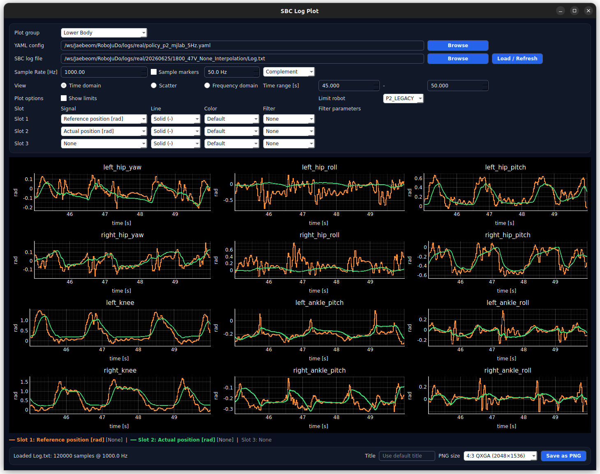

# SBC Log Plotter

Standalone GUI for SBC `.txt` logs.

## Preview

<p align="center">
  
</p>

## Install

Use whichever environment tool you prefer.

### uv / pip

```bash
cd sbc-log-plotter
uv venv
uv pip install -e .
uv run sbc-log-plot --yaml /path/to/policy.yaml --sbc-log /path/to/Log.txt
```

Plain pip also works:

```bash
python -m venv .venv
. .venv/bin/activate  # Windows: .venv\\Scripts\\activate
pip install -e .
sbc-log-plot --yaml /path/to/policy.yaml --sbc-log /path/to/Log.txt
```

### conda

```bash
conda create -n sbc-log-plotter python=3.11 -y
conda activate sbc-log-plotter
pip install -e .
sbc-log-plot --yaml /path/to/policy.yaml --sbc-log /path/to/Log.txt
```

### pixi

```bash
pixi install
pixi run sbc-log-plot --yaml /path/to/policy.yaml --sbc-log /path/to/Log.txt
```

## Run

Open the GUI and choose YAML/log files from the file pickers:

```bash
sbc-log-plot
```

With pixi:

```bash
pixi run sbc-log-plot
```

You can also pass paths directly:

```bash
sbc-log-plot --yaml /path/to/policy.yaml --sbc-log /path/to/Log.txt
```

## YAML contract

```yaml
joint_order:
  robot:            # physical SBC message order
    - WAIST
    - L_HIP_PITCH

sbc_log:
  total_motor_count: 27
  lower_start_index: 14
  plot_groups:      # optional UI order
    Lower Body:
      - L_HIP_YAW
      - L_HIP_ROLL
      - L_HIP_PITCH
    Waist:
      - WAIST
```

- `total_motor_count`: number of motor blocks per row
- `lower_start_index`: index where `joint_order.robot` starts
- `plot_groups`: UI groups shown as `Lower Body`, `Upper Body`, `Waist`, `All`

## Log row format

Each row is whitespace/tab-separated numeric data:

```text
total_motor_count * 11 motor fields + 4 ankle axes * 4 ankle fields
```

Motor field order:

```text
ref_pos ref_vel ref_kp ref_kd ref_torq out_torq act_pos act_vel act_torq status_word torq_cmd_pdo
```
